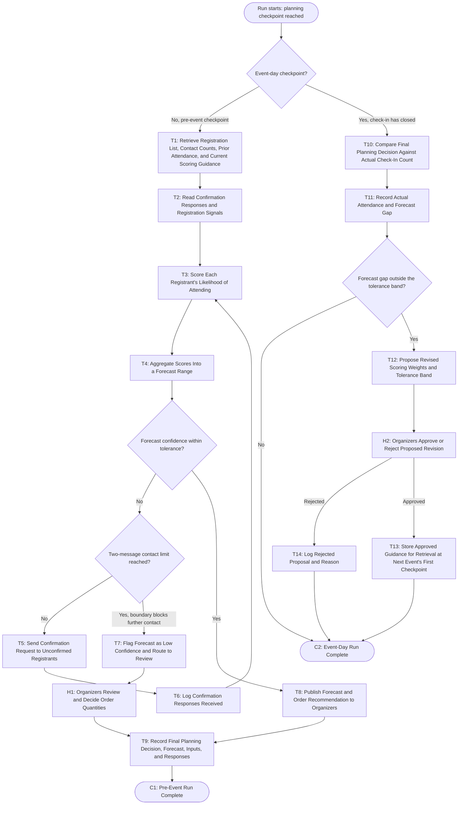

# Workflow of Tasks

## 1. Workflow Overview
### 1.1 Workflow Goal
This workflow supports the system goal defined in `my_first_agent/README.md`.

### 1.2 Workflow Trigger

One run begins when a scheduled planning checkpoint is reached: 14 days, 7 days, and 2 days before the hackathon, plus a final checkpoint when check-in closes on event day. Each checkpoint is one run. The three pre-event checkpoints each produce one forecast; the event-day checkpoint evaluates the final published forecast against actual check-in attendance.

### 1.3 Completion Condition at Runtime

A pre-event run is finished when a final planning decision, meaning a forecast attendance range and the food, drink, and swag quantities it implies, has been recorded in the forecast record along with the inputs behind it, whether that decision came from the system's published forecast or from organizer review; and when any confirmation messages sent during the run have been logged against each registrant's contact count.

The event-day run is finished when the gap between the final planning decision and the actual check-in count has been recorded, and when any proposed revision to the scoring weights or tolerance band has either been approved and stored for the next event or rejected and logged.

### 1.4 General Workflow

A pre-event run starts at a planning checkpoint. The system retrieves the current registration list, each registrant's current contact count, and attendance records from prior CPVC events, then reads each registrant's confirmation responses and registration signals, such as how early they registered and whether they have attended a past club event. From those signals it scores each registrant's likelihood of attending and aggregates the individual scores into a forecast range. If the confidence in that range is within tolerance, the system publishes the forecast and the food, drink, and swag quantities it implies to the organizers' channel. Either way, the run ends by recording a final planning decision: the published forecast when confidence was within tolerance, or the quantities the organizers chose during review when it was not.

Two things interrupt that path. When too many registrants remain unconfirmed for the forecast to be trusted, the system checks each registrant's contact count before doing anything. If a registrant is already at the two-message limit, no further message is sent, because the goal boundary forbids it; instead the forecast is flagged as low confidence and routed to organizer review, where a person decides what to order and that decision is recorded as the final planning decision for the checkpoint. If the limit has not been reached, the system sends a confirmation request to the unconfirmed registrants, logs the responses that come back, and rescores, which is the one loop in the workflow.

The event-day run is different. Confirmation replies are still predictions of attendance, so the forecast is not evaluated against them. Instead, once check-in closes, the system compares the final planning decision from the 2-day checkpoint against the actual check-in count and records the gap. If the gap is outside the tolerance band, the system proposes revised scoring weights and a revised tolerance band, but does not apply them. The organizers review the proposal, because a single unusual event should not automatically change how future events are forecast. Only an approved revision is stored, and it is retrieved by T1 at the start of the next event's first checkpoint rather than feeding back into the current run.

### 1.5 Workflow Diagram

