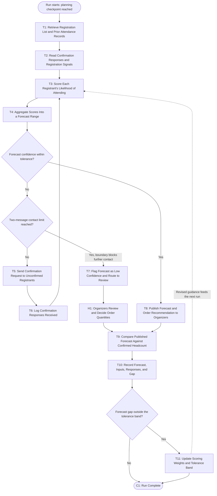

# Workflow of Tasks

## 1. Workflow Overview
### 1.1 Workflow Goal
This workflow supports the system goal defined in `my_first_agent/README.md`.

### 1.2 Workflow Trigger

One run begins when a scheduled planning checkpoint is reached: 14 days, 7 days, and 2 days before the hackathon, plus a final checkpoint when check-in closes on event day. Each checkpoint is one run, and each run produces one forecast.

### 1.3 Completion Condition at Runtime

A run is finished when a forecast attendance range and the food, drink, and swag quantities it implies have either been posted to the organizers' channel or placed in the organizer review queue; when the forecast, the inputs behind it, and the gap against the latest confirmed headcount have been written to the forecast record; and when any confirmation messages sent during the run have been logged against each registrant's contact count.

### 1.4 General Workflow

A run starts at a planning checkpoint. The system retrieves the current registration list along with attendance records from prior CPVC events, then reads each registrant's confirmation responses and registration signals, such as how early they registered and whether they have attended a past club event. From those signals it scores each registrant's likelihood of attending and aggregates the individual scores into a forecast range. If the confidence in that range is within tolerance, the system publishes the forecast and the food, drink, and swag quantities it implies to the organizers' channel. It then compares the published forecast against the latest confirmed headcount, records the forecast with its inputs and the resulting gap, and ends the run.

Two things interrupt that path. When too many registrants remain unconfirmed for the forecast to be trusted, the system checks each registrant's contact count before doing anything. If a registrant is already at the two-message limit, no further message is sent, because the goal boundary forbids it; instead the forecast is flagged as low confidence and routed to organizer review, where a person decides what to order. If the limit has not been reached, the system sends a confirmation request to the unconfirmed registrants, logs the responses that come back, and rescores, which is the one loop in the workflow. Separately, once the gap between forecast and confirmed headcount is known, a gap outside the tolerance band triggers an update to the scoring weights and the tolerance band itself, so the next checkpoint and the next event use revised guidance rather than repeating the same error.

### 1.5 Workflow Diagram

